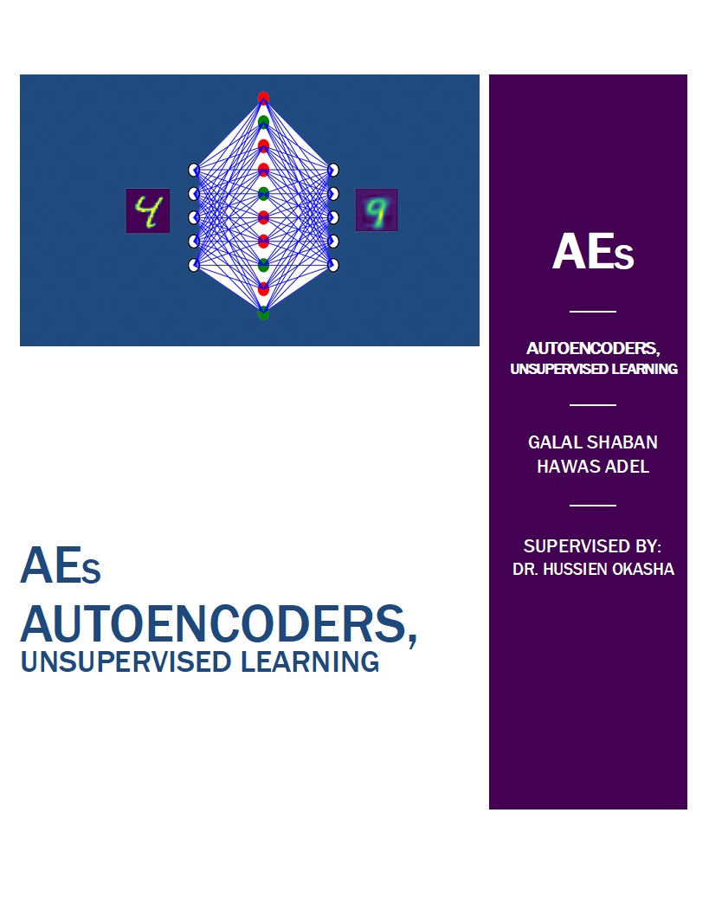

# Autoencoder

     
## Our Nural Network Project :

                                  Autoencoder which is an artificial neural network used for unsupervised learning of
                                  efficient codings. The aim of an autoencoder is to learn a representation (encoding) 
                                  for a set of data, typically for the purpose of dimensionality reduction.

## Unsupervised Learning :

                                  Unsupervised machine learning is the machine learning task 
                                  of inferring a function to describe hidden structure from 
                                  "unlabeled" data (a classification or categorization is not 
                                  included in the observations).

## Architecture :

                                  The nural network is built of 4 layers and an input layer (3 hidden layers) 
                                  of sizes 784, 392, 196, 392 and 784 respectively.

## Libary Used :
<pre>
                                  - tensorflow as tf
                                  - matplotlib.pyplot as plt
                                  - import numpy as np
</pre>

### This project's Dataset is in <a href="https://github.com/Galileo103/Autoencoder/tree/master/MNIST_data" style="text-decoration:none"> MNIST_data </a> folder

### There are some snapshots for the output of the program with defferent settings in <a href="https://github.com/Galileo103/Autoencoder/tree/master/Snapshot" style="text-decoration:none"> Snapshots </a>
### This is the Snapshot 1
#### You can see the encoder in the second image (2) that converted into (3), the seventh image (4) that converted into (7) and the ninth image (5) that converted into (9)
 

## The References  <a href="https://github.com/Galileo103/Autoencoder/tree/master/References" style="text-decoration:none"> here </a>

<ol>
  <li>Autoencoders, Unsupervised Learning, and Deep Architectures</li> is the paper from University of California, Irvine
  <li>Andrew Ng Lecture about Autoencoders</li> is the stanford presentation for professor Andrew that takes about autoencoder
</ol>
